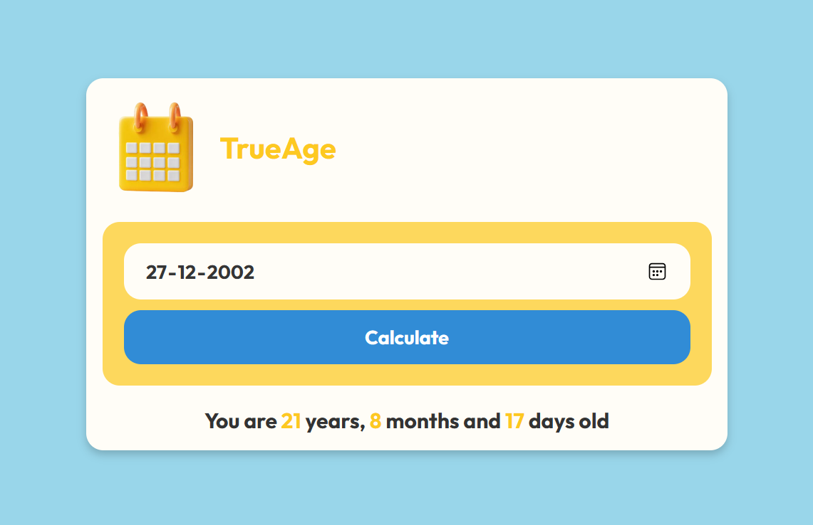
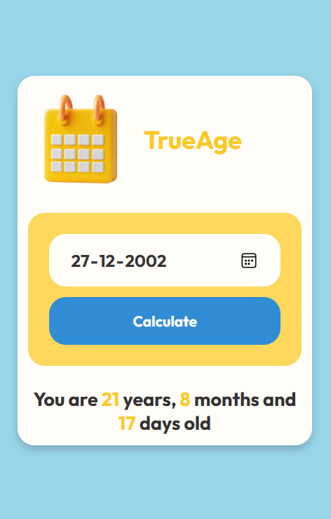

# TrueAge-AgeCalculator
TrueAge is a simple, intuitive, and fully responsive age calculator that allows users to calculate their exact age based on their date of birth. Built using fundamental web technologies, this project emphasizes clean design, user-friendly experience, and compatibility across devices.

# ⚙️ Demo
- 

## ✨ Key Features

- **Fully Responsive Design**:  
  The interface adjusts seamlessly to various screen sizes, providing an optimal experience on laptops, tablets, and mobile devices. Check out the screenshots below to see how TrueAge looks across different screen sizes:

  - 🖥️ **Laptop View**:  
    

  - 📱 **Tablet View**:  
    

  - 📲 **Mobile View**:  
    

- **Eye-Pleasing UI**:  
  TrueAge features a clean, modern design with an emphasis on usability and visual appeal. The minimalistic design ensures the focus stays on functionality while offering a pleasant user experience.

- **Simple Technologies**:  
  TrueAge is built using fundamental web technologies, including:

  - **HTML5**: For the structural layout
  - **CSS3**: For styling and responsiveness
  - **JavaScript**: For core functionality and calculations

  These technologies make the project easy to understand, allowing developers of all levels to learn key concepts related to front-end web development.

## 🚀 How It Works

1. Enter your date of birth.
2. Click on the "Calculate Age" button.
3. Instantly see your age in years, months, and days.

## 🛠️ Installation

To run the project locally:

1. Download the repo [here](link to repo).
2. Open the `index.html` file in your preferred browser.

## 🤝 Contributing

Feel free to fork this repository, make your enhancements, and open a pull request. Contributions are welcome!
